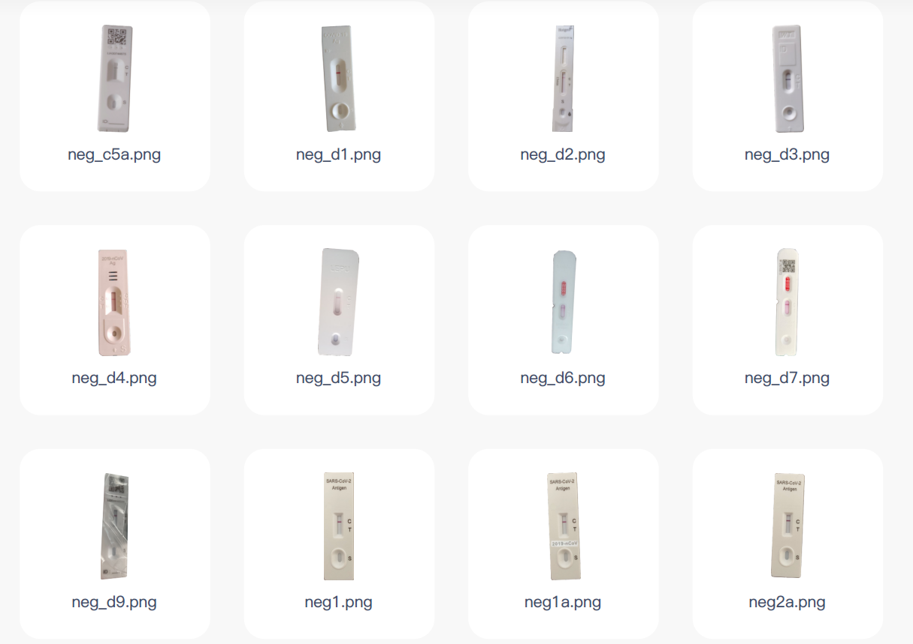
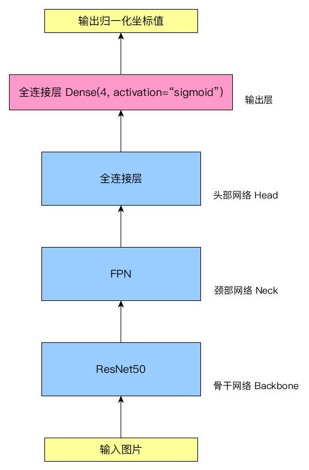

# 抗原检测试剂盒位置检测数据集的构建方法及模型训练方法


## 创新点

1. 自动化生成具备泛化能力的试剂盒图片的方法
2. 具备旋转角度信息的试剂盒位置标注的方法
3. 基于此数据集进行模型训练的方法


## 问题描述

​		在新冠疫情期间，新冠病毒抗原检测试剂盒是一种简单快速的自助检测方法，非医疗专业人士也可以通过试剂盒上标线对检测结果进行判读。通常，各级卫生部门会要求上传检测结果的照片图片，对检测结果进行核实和统计，但是人工判读海量检测结果是一个工作量巨大的重复性工作。因此，使用基于深度学习模型的方法对抗原检测试剂盒结果进行判读成为缓解人工判读压力的替代方法。

​		使用深度学习模型进行试剂盒结果判读，可分为两个步骤：（1）从图片中检测试剂盒标线区域的位置；（2）对标线结果进行判读。例如，下图中方框部分即为标线区域。


​		在使用深度学习模型进行试剂盒的位置检测前，需要对模型进行训练。因此，如何构建训练数据集，对模型的检测能力和效果具有不可忽视的影响。通常情况下，为提高数据集的泛化能力，需要采集真实环境下各类可能场景下的图片作为训练数据集。而由于新冠疫情的特殊性，短时间内收集大量各类抗原检测试剂盒图片是不现实的。因此，如何构建这样的位置检测训练数据集，并能够稳定训练出具备泛化能力的模型，是试剂盒结果判读任务的关键。


## 数据集的构建方法

​		训练数据集的构建首先要考虑数据集的泛化能力。概括地说，泛化能力是指深度学习模型对新鲜样本的适应能力。训练的目的是学到隐含在数据背后的规律，对具有同一规律的训练集以外的数据，经过训练的模型也能给出合适的输出，该能力称为泛化能力。

​		考虑试剂盒位置检测的任务，结合现实可能出现的场景，需要考虑以下可能的因素：

1. 因拍摄者不是专业人士，拍摄试剂盒照片时，试剂盒的方向、角度、光照、清晰度等均不可控；
2. 拍摄背景，可能是平面、桌面、地板、手持悬空，等复杂背景；
3. 试剂盒可能因为手持、塑料包装等物品进行部分遮挡；
4. 试剂盒旁可能会出现文字说明、身份证、户口簿等说明性文件；
5. 不同生产厂商的试剂盒正面布局、文字、图案等也有一定的差异。

​		

​		数据集构建的过程，可以分布两步：（1）自动化生成试剂盒图片；（2）图片数据的标注。


### 生成试剂盒图片的方法

​		根据上述需考虑的场景因素，设计生成试剂盒图片的方法和步骤如下：

1. 定义：

   （1）图片集合characters，包含可收集到的不同厂商的试剂盒正面图片，均为正常视角；（如下图）

   

   （2）图片集合backgrounds，包含各种背景图片，包含但不限于：纯色背景、各类材质的图片、各类复杂场景的图片等；（如下图）

   

   （3）图片集合objects，包含各种可能与试剂盒同时存在的物品图片，包含但不限于：手持的造型、身份证件、说明卡片等；（如下图）

   

2. 从characters中随机抽取一个图片A

3. 从backgrounds中随机抽取一个图片B

4. 随机生成图片B的缩放比例，（其中randint返回两个参数之间的随机整数）

   横向缩放比例：```B_x_ratio = randint(2, 5)```

   纵向缩放比例：```B_y_ratio = randint(2, 5)```

5. 对图片B进行尺寸变化，横向缩小B_x_ratio倍，纵向缩小B_y_ratio倍；生成新图片B2，宽记为B2_width，高记为B2_height
6. 随机生成图片A的旋转角度A_rotate_angle，其中A_rotate_angle可能的取值为```[0, 90, 180, 270]```（即，试剂盒只在横向和纵向变换角度）
7. 对图片A进行逆时针旋转A_rotate_angle角度，生成图片A2，宽记为A2_width，高记为A2_height
8. 随机生成图片A2在图片B2上的位置坐标(x, y)，方法如下：（其中abs为取绝对值）
    ```
    tmp_x = B2_width / 2 - A2_width / 2
    tmp_y = B2_height / 2 - A2_height / 2
    x = tmp_x + randint(-abs(tmp_x), abs(tmp_x)+1)
    y = tmp_y + randint(-abs(tmp_y), abs(tmp_y)+1)
    ```

9. 将图片A2放置在B2的```(x, y)```位置，合成新图片C

10. 随机选择是否添加objects的图片，如果添加，则继续步骤11；如果不添加，则将图片C命名为图片E，并跳转到步骤16

11. 从objects中随机抽取一个图片D，宽记为D_width，高记为D_height

12. 随机产生D相对于A2的位置D_pos，其中D_pos可能的取值为```["left", "right", "above", "below"]```（即，D可以在A2的左侧、右侧、上面、下面）

13. 当D_pos为"left"时：

    ```
    D_x_offset = A2_width + randint(0, A2_width / 3)
    D_y_offset = randint(-50, -10)
    ```
当D_pos为"right"时：
    ```
    D_x_offset = A2_width + randint(- A2_width / 3, 0)
    D_y_offset = randint(-50, -10)
    ```
当D_pos为"above"时：
    ```
    D_x_offset = randint(-80, -30)
    D_y_offset = A2_height + randint(0, A2_height / 3)
    ```
当D_pos为"below"时：
    ```
    D_x_offset = randint(-80, -30)
    D_y_offset = A2_height + randint(- A2_height / 3, 0)
    ```

14. 计算图片D在C上的位置```(x2, y2)```为：
    ```
    x2 = x + D_x_offset
    y2 = y + D_y_offset
    ```

15. 将图片D放置在C的```(x2, y2)```位置，合成新图片E

16. 将图片E进行高斯模糊处理，高斯模糊的模糊半径随机选取```[0, 1, 2]```（其中0即为不进行模糊处理），生成图片F

17. 保存图片F，即为一个随机生成的训练集图片

18. 重复2至17的步骤，直到完成指定数量的图片生成


​		使用上述步骤就可以批量自动化生成具备泛化能力的训练数据集图片，下图为生成的部分试剂盒图片示例。


### 数据标注的方法

​		在完成图片生成后，为进行模型训练，需要对数据集图片进行标注，使训练后的模型可以检测到试剂盒标线区域的位置。

​		数据标注需要将试剂盒标线区域的位置进行标注。因为在上述图片生成时，对试剂盒进行了旋转，因此在标注时，也需要将旋转角度信息进行标注。传统的方法是在位置坐标信息之外，单独对角度信息进行标注。此处，为简化模型设计和损失函数设计，不对角度信息进行单独标注，而是将角度信息隐含在坐标信息中进行标注。具体方法如下。


**针对一个试剂盒图片进行标注的方法：**

1. 定义：正常视角下，试剂盒标线区域的对角坐标点为A、B两点，其中A为正常视角左上角顶点，B为正常视角右下角顶点。不论试剂盒如何旋转，AB两点也同时旋转，保持AB两点与试剂盒的相对位置不变。如下图所示：

   |  |  |  |  |
   | :---------------------------------------------------: | :---------------------------------------------------: | :---------------------------------------------------: | :---------------------------------------------------: |

   

2. 对某一图片C，图片的宽记为C_width，高记为C_height

3. 按步骤1中的定义，人工标记出C上的标线区域，可得A、B点的位置；点A在图片C上的坐标记为``` (Xa, Ya)```，点B在图片C上的坐标记为```(Xb, Yb)```

4. 对A、B的坐标进行归一化处理：

   ```
   Xa2 = Xa / C_width
   Ya2 = Ya / C_height
   Xb2 = Xb / C_width
   Yb2 = Yb / C_height
   ```

   至此，图片C可以用4个[0,1]区间的浮点数进行标注：```(Xa2, Ya2, Xb2, Yb2)```


​		由上述定义可知，因为A、B两点随着试剂盒的旋转同时旋转，同时已知试剂盒旋转角度为```[0, 90, 180, 270]```四个取值之一，因此试剂盒旋转的角度，可以根据A、B坐标的相对位置进行推定。


**根据A、B坐标推定试剂盒旋转角度的方法：**

1. 设图片标注数据为 ```(Xa2, Ya2, Xb2, Yb2)```
2. 如果```Xa2<Xb2```，跳转到步骤3；否则跳转到步骤4
3. 如果```Ya2<Yb2```，则旋转角度rotate_angle=0；否则rotate_angle=90；跳转到步骤5
4. 如果```Ya2<Yb2```，则旋转角度rotate_angle=270；否则rotate_angle=180
5. 此时rotate_angle即为试剂盒逆时针旋转的角度


## 模型训练方法

​		深度学习模型训练的一般过程均是相似的，目的是使模型的预测值与真实值无限接近，即实现模型收敛。对模型能否正常收敛影响较大的几个因素有：（1）训练数据集的泛化能力，（2）深度神经网络模型的设计，和（3）损失函数的设计。前述内容已针对数据集进行了说明，下面对（2）、（3）的因素进行说明。


### 对现有模型的改进

​		当前，用于目标检测的模型非常丰富。从模型结构上，一般均由骨干网络、颈部网络、头部网络三部分组成。骨干网络可以使用常见的深度卷积网络（例如：VggNet、ResNet、DenseNet、MobileNet等），颈部网络可以使用特征金字塔（FPN）网络（如果为简化参数数量，也可以不使用颈部网络），头部网络使用多层全连接网络。

​		为使用前述定义的训练数据集，需要对头部网络进行改进。在传统的目标检测网络中，需要返回坐标、角度、类别等多种数据，数据的激活方式不同，其中数值回归一般使用relu激活函数作为输出。在前述训练集的数据标注中，因为进行了数据归一化处理，因此头部网络的最后一层需要使用sigmoid激活函数进行输出，保证输出的数据在[0,1]范围内，而且只需要输出4个数据，简化了头部网络的设计。

​		我们实际使用的网络模型示意图如下，骨干网络使用ResNet50，颈部网络使用FPN，头部网络使用若干层全连接层，最后一层输出4个使用sigmoid激活的数据。即可得到前述A、B两点的归一化的坐标。




### 损失函数的设计

​		损失函数（loss function）是用来估量模型的预测值与真实值的不一致程度，对模型训练时能否正常收敛起到关键作用。结合试剂盒标线区域检测的目标和坐标数值回归的目标，针对上述模型设计的损失函数（box_loss）由两部分组成：IoU损失和MSE均方差损失。其中，IoU为预测区域和真实区域的相交面积与合并面积的比值，MSE均方差为预测值和真实值之间距离的平方。

​		这里需要特别设计的是IoU损失函数。由前述数据集中标注信息的定义，A、B两点的坐标是随着试剂盒一同旋转的。因此，相较于通常的IoU计算，不能假设A、B两点相对位置是固定的，即IoU的计算不能依赖A、B点的相对位置。


**模型训练的损失函数的计算如下：**

1. 设真实值y_true为一个四个元素的数列，用y_true[n]表示，其中n=0,1,2,3

   设预测值y_pred为一个四个元素的数列，用y_pred[n]表示，其中n=0,1,2,3

2. 进行如下中间计算：(其中abs计算绝对值，max取两数的最大值)
    ```
    w1 = abs(y_true[2] - y_true[0])
    w2 = abs(y_pred[2] - y_pred[0])
    h1 = abs(y_true[3] - y_true[1])
    h2 = abs(y_pred[3] - y_pred[1])
    dw1 = abs(y_true[0] - y_pred[0])
    dw2 = abs(y_true[2] - y_pred[2])
    dh1 = abs(y_true[1] - y_pred[1])
    dh2 = abs(y_true[3] - y_pred[3])
    w3 = (w1 + w2 - dw1 - dw2) / 2
    h3 = (h1 + h2 - dh1 - dh2) / 2
    ```
    
3. 此时，可得预测值与真实值的相交面积 intersection

    ```
    intersection = max(w3, 0) * max(h3, 0)
    ```

4. 可得预测值与真实值的合并面积 union

    ```
    union = w1 * h1 + w2 * h2 - intersection
    ```

5. 进而可得 IoU

    ```
    iou = intersection / union
    ```

6. 设mse()为均方差损失函数，则试剂盒标线区域预测模型的损失函数 box_loss为：

    ```
    box_loss = (1 - iou) + mse(y_true, y_pred)
    ```


​		至此，使用改进设计的损失函数box_loss，可以针对前述训练数据集进行模型训练，保证模型的收敛，实现试剂盒标线区域位置检测的功能。
